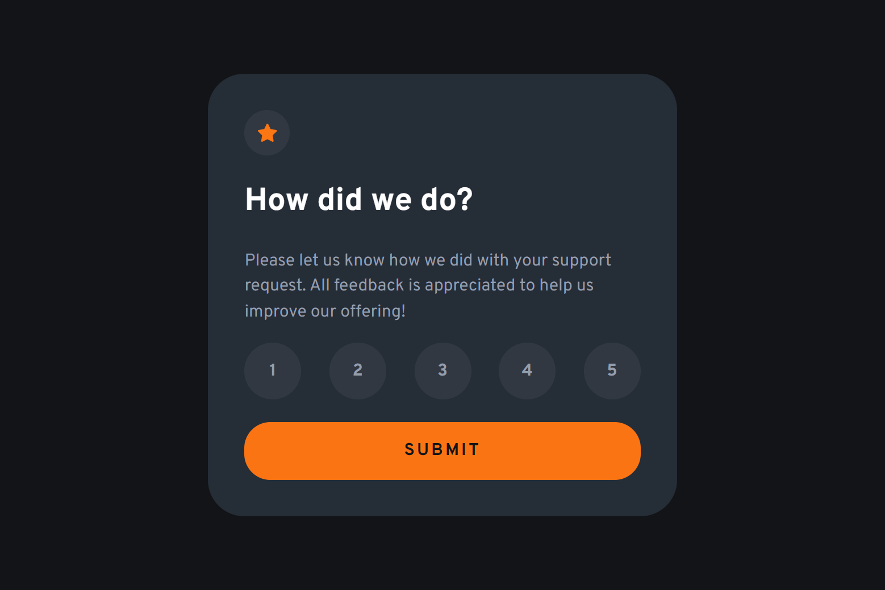

# Frontend Mentor - Interactive rating component solution

This is a solution to the [Interactive rating component challenge on Frontend Mentor](https://www.frontendmentor.io/challenges/interactive-rating-component-koxpeBUmI). Frontend Mentor challenges help you improve your coding skills by building realistic projects.

## Table of contents

-   [Overview](#overview)
    -   [The challenge](#the-challenge)
    -   [Screenshot](#screenshot)
    -   [Links](#links)
-   [My process](#my-process)
    -   [Built with](#built-with)
    -   [What I learned](#what-i-learned)
    -   [Useful resources](#useful-resources)
-   [Author](#author)

## Overview

### The challenge

Users should be able to:

-   View the optimal layout for the app depending on their device's screen size
-   See hover states for all interactive elements on the page
-   Select and submit a number rating
-   See the "Thank you" card state after submitting a rating

### Screenshot

### Links

-   Solution URL: [Solution URL](https://github.com/Andro87/interactive-rating-component.git)
-   Live Site URL: [Live site URL](https://interactive-rating-component-ten-sooty.vercel.app/)

## My process

### Built with

-   Semantic HTML5 markup
-   SASS / SCSS
-   Flexbox
-   Mobile-first workflow
-   [React](https://reactjs.org/) - JS library
-   [Next.js](https://nextjs.org/) - React framework

### What I learned

This project is part of the [Introduction to web accessibility](https://www.frontendmentor.io/learning-paths/introduction-to-web-accessibility-mXu-9PHVsd) learning path on the Frontend Mentor platform.
It has helped me to gain a better understanding of accessibility best practices and key concepts in this area.
I aim to continue expanding my knowledge in this crucial field and ensure that the websites I work on are accessible to everyone.

### Useful resources

-   [Make your website more readable](https://developer.chrome.com/docs/devtools/accessibility/contrast)

## Author

-   Frontend Mentor - [@Andro87](https://www.frontendmentor.io/profile/Andro87)
